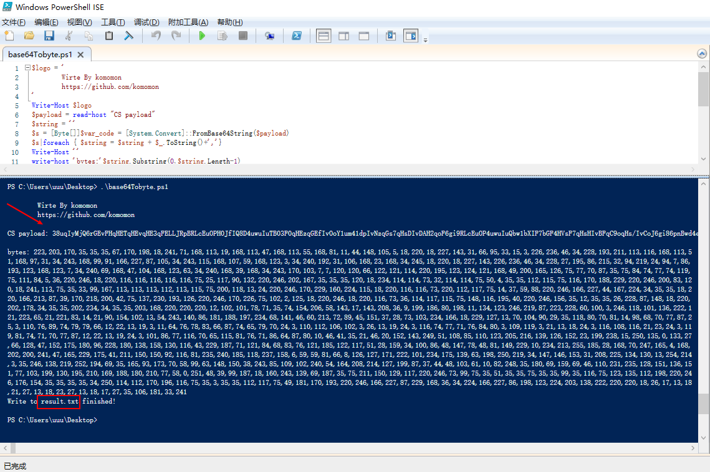

## Powershell_bypassAV

> 记录自己powershell 免杀的一些自动化脚本

详细使用看文章：[Powershell 免杀过 defender 火绒，附自动化工具](https://mp.weixin.qq.com/s?__biz=Mzg2ODYxMzY3OQ==&amp;mid=2247484469&amp;idx=1&amp;sn=bdac380ee95fd0ef72581a3b60da1443&amp;chksm=cea8ef75f9df66630e2148be842428802b27bcee1cb09748cbc200046742b8052cb6f873e115&token=1131002789&lang=zh_CN#rd)

> base64Tobyte.ps1

是将base64字符串转换成byte数组绕过查杀。

是为了免杀CS的powershell马用的，当然可以分离用作其他地方。

### 一起交流

感兴趣的可以关注公众号回复“**加群**”，添加Z2OBot 小K自动拉你加入**Z2O安全攻防交流群**分享更多好东西。

